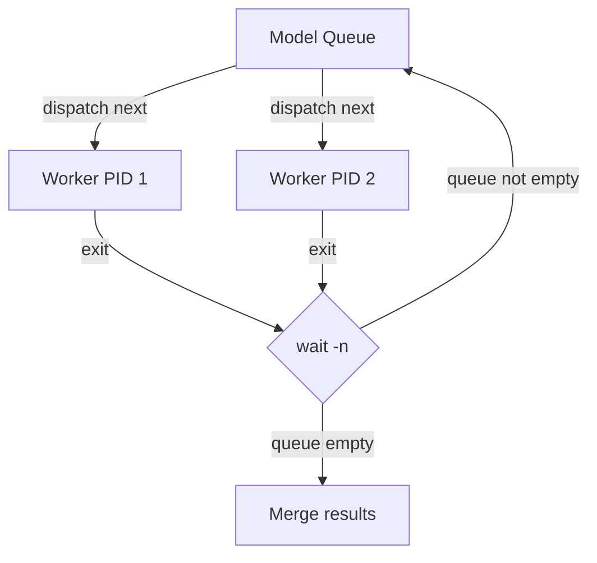

## Single-runner background job parallelism

### Problem
Hard-coded `group1`/`group2` model split. Adding models requires manual rebalancing. Not truly parallel - jobs are scheduled on separate VMs with no dynamic dispatch.

### Solution
Run all models on a **single runner** using shell `&` background processes and `wait -n` to dynamically dispatch: as soon as one model finishes, start the next. This is the true `||` pattern.

### Architecture



### Changes

**1. `scripts/test_models.py`**
- Remove `GROUP1_MODELS`, `GROUP2_MODELS`, `MODEL_GROUP`, `selected_models()`
- Remove `WORKER_INDEX` / `TOTAL_WORKERS` env vars (not needed)
- Add `PARALLEL_WORKERS` env var (default 2) controlling how many concurrent API calls
- Add `MODEL_INDEX` env var so the dispatch script can test a single model
- When `MODEL_INDEX` is set, only test `ALL_MODELS[int(MODEL_INDEX)]` and output to `results-worker{INDEX}.json`
- Remove history writing from the script itself (merge step handles it)

**2. New: `scripts/benchmark_dispatch.sh`**
- Small shell script that implements the `& + wait -n` loop
- Maintains a queue of model indices
- Keeps N workers running at all times
- When `wait -n` returns, grabs next model index, launches `python3 scripts/test_models.py` with `MODEL_INDEX=X`
- When queue empty and all workers done, exits

**3. `.github/workflows/benchmark.yml`**
- **Single job** instead of 3 separate jobs
- Step 1: Run `bash scripts/benchmark_dispatch.sh` (spawns parallel workers)
- Step 2: Run `python3 scripts/merge_results.py` (merges all `results-worker*.json`)
- Step 3: Compress and commit `history.db.gz`

**4. `scripts/merge_results.py`**
- Glob for `results-worker*.json` instead of hardcoded group files (already partially planned)
- Clean up temp files after merge

### How dispatch works (pseudo)
```bash
queue=(0 1 2 3 4)  # model indices
active_pids=()
while queue or active_pids; do
  while active_pids < PARALLEL and queue; do
    idx=queue.pop()
    python3 test_models.py MODEL_INDEX=$idx &
    active_pids += $!
  done
  if active_pids; then
    wait -n  # returns when any child exits
    active_pids.remove(finished)
  fi
done
```

### `test_models.py` single-model mode
When `MODEL_INDEX=N` is set:
- Test only `ALL_MODELS[N]`
- Write `scripts/results-workerN.json` with one model result
- No history writing (merge step handles it)

If `MODEL_INDEX` is not set, fall back to current sequential behavior (backward compat for local runs).
